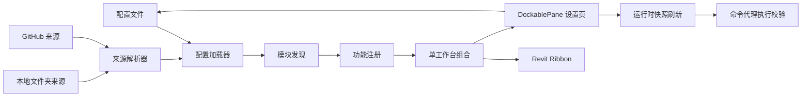

# PlugHub V2 设计规格

日期：2026-05-26

## 目标

将当前 PlugHub 模块化插件框架升级为 PlugHub。V2 聚焦框架治理能力：统一品牌命名、简化视图模型、深化模块/功能开关、自定义显示名称、DockablePane 设置界面、明确热重载边界，并为本地文件夹和 GitHub 仓库模块来源预留可验证实现。

本规格不实现新的 Revit 业务命令。框架层继续只提供模块契约、发现、启用/禁用、排序/组合、诊断和 Revit 2020 入口适配。

## 范围

V2 包含：

- 项目、解决方案、程序集、命名空间、addin 清单、Ribbon 文案、配置样例和文档中的 PlugHub/PlugHub 品牌迁移到 PlugHub。
- 本地文档中的仓库名同步为 `GaoMengGu/PlugHub`。真实 GitHub 仓库重命名需要在 GitHub 站点设置中完成，本地代码只能同步引用。
- 取消多视图集对用户的暴露，仅保留一个工作台视图承载所有模块和功能。
- 模块名称与功能名称允许用户在配置中覆盖。
- 模块与功能开关尽量即时生效；无法即时改变的 Ribbon 结构类变更标记为待重启。
- 设置页面以 Revit DockablePane 形式展现，支持右键菜单和拖拽排序。
- 模块来源支持用户配置指定本地文件夹或 GitHub 仓库。

V2 不包含：

- 不承诺 Revit 已加载 .NET Framework 程序集真正卸载。
- 不承诺 Revit Ribbon 已创建按钮、panel、大小、图标可以完全即时重建。
- 不实现远程插件市场、授权系统、自动更新服务。
- 不在非 Revit 环境声称完成实机验证。

## 方案选择

采用稳健 V2 方案。

不优先采用深度 AppDomain 热卸载方案，因为 Revit 2020、.NET Framework 和 Revit Ribbon API 对已加载程序集及 UI 结构的运行期替换都有限制。V2 将热重载定义为配置和执行 gating 的即时刷新，并把 Ribbon 结构变更清晰标记为待重启。

不采用仅 UI 优先方案，因为品牌、视图模型和配置模型会影响后续所有交互。如果只改界面，会留下更大的兼容债。

## 品牌与命名迁移

目标品牌为 PlugHub。

迁移对象：

- `PlugHub.sln` 和 `PlugHub.slnx` 改为 `PlugHub.sln` 和 `PlugHub.slnx`。
- `src/PlugHub.*` 项目目录、csproj、程序集名和默认命名空间迁移到 `src/PlugHub.*`。
- `PlugHub.Contracts`、`PlugHub.Framework`、`PlugHub.Revit2020`、`PlugHub.StaticValidation` 分别迁移为 `PlugHub.Contracts`、`PlugHub.Framework`、`PlugHub.Revit2020`、`PlugHub.StaticValidation`。
- `PlugHub.BuiltinModule` 改名为内置示例业务模块，推荐命名 `PlugHub.BuiltinModule`。其中现有风管和族工具仍作为已迁入示例命令保留。
- `IPlugHubModule` 改名为 `IPlugHubModule`。为减少一次性破坏，可在 V2 保留旧接口类型的兼容适配，并在文档中标记后续版本移除。
- Ribbon tab 默认名改为 `PlugHub`。
- addin 名称改为 `PlugHub Framework`，程序集指向 `PlugHub.Revit2020.dll`。
- 配置 id 和命令 key 使用稳定业务前缀，例如 `plughub.builtin.*` 和 `builtin.*`。

验收要求：

- 源码、配置、脚本、文档中不再出现面向用户的 PlugHub/PlugHub 品牌。
- 如果保留旧命名，只能作为兼容迁移注释、旧接口适配或迁移说明出现。

## 单工作台视图

取消用户可选的 `default`、`admin`、`training`、`project-a` 视图集。一个工作台视图足够展示所需插件模块。

内部模型：

- 保留 composer 的 `ViewConfiguration` 概念作为兼容层，但配置只生成一个 `workspace` 视图。
- `views.json` 简化为单工作台配置，或在后续重构中合并进 `workspace.json`。
- `feature-combinations.json` 在 V2 中变为可选文件，不再作为主要入口组合机制。
- 过滤逻辑从“视图选择”转为“模块/功能的 enabled、visible、group、order、tags/category 辅助筛选”。

设置界面中不再显示“当前视图”下拉框。用户看到的是一个 PlugHub 工作台，里面有模块列表、功能列表和分组/panel 组织。

验收要求：

- 静态验证只要求一个 active workspace。
- README 不再指导用户切换视图。
- Ribbon 启动时只创建一个 PlugHub tab。

## 自定义名称与显示覆盖

模块和功能支持用户自定义名称，同时保留稳定 id。

配置模型：

- `ModuleConfiguration.Name` 继续作为默认显示名。
- 新增 `DisplayName` 属性，对应 JSON 字段 `displayName`，用于用户覆盖模块名称。
- `FeatureConfiguration.Name` 继续作为默认功能名。
- 新增 `DisplayName` 属性，对应 JSON 字段 `displayName`，用于用户覆盖功能按钮名称。
- 运行时显示名解析顺序为：用户覆盖名 > 配置名 > 模块运行时 descriptor 名 > id。

统一采用 `displayName` 字段，避免 `name` 同时承担模块发布者默认名和用户个性化名。

示例：

```json
{
  "id": "plughub.builtin.duct-tools",
  "name": "风管工具",
  "displayName": "机电风管",
  "features": [
    {
      "id": "plughub.builtin.duct-tools.switch-preferred-junction",
      "name": "切换风管首选连接",
      "displayName": "Tee/Tap 切换"
    }
  ]
}
```

验收要求：

- 设置页可编辑模块显示名和功能显示名。
- Ribbon 和设置页都使用同一套显示名解析逻辑。

## 开关与热重载边界

V2 将热重载分为三类。

即时生效：

- 模块 enabled/visible 状态。
- 功能 visible/defaultState 状态。
- 模块/功能显示名在设置页内刷新。
- 功能执行前的开关校验。
- 本地配置重新加载和诊断刷新。

待重启生效：

- 新增或删除 Ribbon 按钮。
- Ribbon panel 结构变化。
- 按钮大小从 large/small 切换。
- 图标更换。
- 新增模块程序集首次加载。
- 已加载程序集二进制替换。

暂时隐藏或提示待重启：

- 对无法在当前 Revit 会话可靠重建的 UI 结构操作，保存后在设置页显示“待重启生效”。
- 对已禁用但 Ribbon 上仍可见的按钮，命令代理在执行前读取最新状态，阻止执行并提示该功能已禁用。

实现策略：

- 增加运行时配置刷新服务，设置保存后更新 `FrameworkRuntimeState` 的快照。
- Ribbon 按钮优先路由到框架代理命令，由代理根据 `commandKey` 或 feature id 查找最新功能状态，再转发到真实 `IExternalCommand`。
- 直接指向业务命令的按钮在 V2 中逐步改为代理路由，确保功能开关可以即时阻断执行。
- 已加载程序集不尝试强制卸载；远程或本地模块更新后标记为待重启。

验收要求：

- 禁用功能后，即使按钮还显示，点击也不会执行业务命令。
- 可即时刷新配置诊断。
- UI 明确区分“已生效”和“待重启生效”。

## DockablePane 设置页面

设置页面从模态 WinForms 窗口升级为 Revit DockablePane。

布局：

- 顶部：PlugHub 标题、保存状态、刷新按钮、待重启提示。
- 左侧：模块列表，显示启用状态、可见状态、来源、排序。
- 右侧：当前模块的功能列表，显示启用/可见、显示名、分组、按钮大小、图标状态、排序。
- 底部或属性区：选中模块/功能的可编辑属性。

右键菜单：

- 模块：启用、禁用、显示、隐藏、重命名、设置来源、上移、下移。
- 功能：启用、禁用、显示、隐藏、重命名、设置图标、设置按钮大小、移动到分组、上移、下移。

拖拽排序：

- 模块拖拽更新模块 `order`。
- 功能在同组内拖拽更新功能 `order`。
- 功能拖到其他分组时更新 `group` 并重算 `order`。

图标设置：

- 配置字段支持 `iconPath`。
- 图标文件优先从模块目录或 PlugHub 配置目录解析。
- 图标变更标记为待重启生效，因为 Revit Ribbon 图像运行期替换不作为 V2 承诺。

验收要求：

- 设置入口打开 DockablePane，而不是只打开模态窗口。
- 右键菜单覆盖启用、禁用、图标、大小、排序相关操作。
- 拖拽排序保存到配置。

## 模块来源

新增模块来源模型，允许从指定文件夹或 GitHub 仓库读取模块。

配置示例：

```json
{
  "moduleSources": [
    {
      "id": "local-company-tools",
      "type": "localFolder",
      "path": "D:/PlugHub/modules/company",
      "enabled": true
    },
    {
      "id": "team-github-tools",
      "type": "github",
      "repository": "GaoMengGu/PlugHubModules",
      "ref": "main",
      "manifestPath": "plughub.modules.json",
      "enabled": false
    }
  ]
}
```

本地文件夹来源：

- 扫描指定目录下的模块清单。
- 模块程序集路径相对来源目录解析。
- 诊断缺失清单、缺失程序集、重复 id 和无效类型。

GitHub 来源：

- V2 设计为可配置能力，默认不自动启用远程来源。
- 拉取到 PlugHub 托管缓存目录。
- 按 `repository`、`ref`、`manifestPath` 定位清单。
- 不自动执行未启用模块；用户必须在设置页显式启用模块。
- 网络失败或 git 不可用时记录诊断，不影响本地模块加载。

安全边界：

- 远程模块等同于执行第三方 .NET 代码，设置页必须显示来源和启用状态。
- V2 不做代码签名和权限沙箱；文档必须明确只启用可信来源。

验收要求：

- 模块发现服务可以合并内置配置、本地文件夹来源和 GitHub 来源产生的模块清单。
- 来源失败不会阻断框架启动，除非策略配置为 fail。
- 诊断中包含来源 id 和失败原因。

## 数据流



## 错误处理与诊断

诊断继续使用框架诊断模型，并补充来源和热重载相关信息。

新增诊断类别：

- `PH-SOURCE-MISSING`：模块来源路径或仓库不可用。
- `PH-SOURCE-MANIFEST`：来源清单缺失或格式错误。
- `PH-RELOAD-DEFERRED`：变更已保存但需重启 Revit。
- `PH-FEATURE-DISABLED`：功能执行被最新配置阻止。
- `PH-NAME-OVERRIDE`：显示名覆盖为空或无效时回退。

诊断展示：

- DockablePane 显示最新诊断摘要。
- 静态验证输出关键计数和失败原因。
- 非 Revit 环境只做 C# 静态验证，不声称实机测试。

## 测试与验证

必须保留并更新静态验证：

```bash
dotnet run --project src/PlugHub.StaticValidation/PlugHub.StaticValidation.csproj
```

重命名完成后，命令应更新为：

```bash
dotnet run --project src/PlugHub.StaticValidation/PlugHub.StaticValidation.csproj
```

为避免迁移期间验收链断裂，可在一轮变更中先保持旧验证入口可用，待解决方案和项目全部迁移后再同步更新文档命令。

验证覆盖：

- 必需文件和项目命名。
- 非 Revit 层不引用 Autodesk.Revit。
- 单工作台配置存在且有效。
- 模块和功能 id 唯一。
- 显示名覆盖解析。
- 来源配置 schema。
- 待重启变更诊断。
- 代理命令包含执行前开关校验。

## 迁移顺序

1. 新增 PlugHub 命名常量和显示名解析逻辑，减少硬编码。
2. 简化配置为单工作台视图，更新 composer 和验证。
3. 增加 `displayName`、`iconPath`、`moduleSources` 配置字段和 schema。
4. 引入运行时刷新与命令代理 gating，明确待重启诊断。
5. 将设置页改为 DockablePane，并实现右键菜单与拖拽排序。
6. 执行项目、程序集、命名空间、文档和清单的 PlugHub 重命名。
7. 更新 README、脚本和静态验证命令。

## 开放风险

- Revit 2020 Ribbon API 对运行期删除、移动和重建按钮支持有限，V2 不承诺这些结构变更即时生效。
- .NET Framework 已加载程序集不能可靠卸载，模块二进制更新需要重启 Revit。
- GitHub 来源需要网络和 git 能力；在受限环境中只能记录诊断并跳过。
- 当前工作目录不是 git 仓库，规格编写阶段无法执行 commit。

## 验收标准

- 项目对外名称为 PlugHub。
- 用户不再需要选择视图集，一个工作台即可看到模块和功能组织。
- 用户可以在设置页自定义模块名称和功能名称。
- 模块/功能开关保存后，执行 gating 尽量即时生效。
- 不能即时生效的 Ribbon 结构变更被标记为待重启。
- 设置页面以 DockablePane 展示，具备右键菜单和拖拽排序设计。
- 模块来源支持本地文件夹和 GitHub 仓库配置。
- 非 Revit 环境通过静态验证，不声称 Revit 实机测试。
